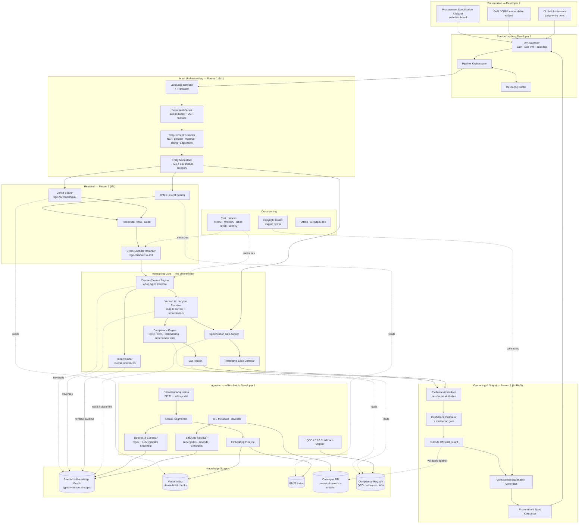

# Phase 2 — Draft Component Architecture

**Project:** Standards360 · **PS ID:** 26108 · **Status:** Draft for Day-2 review

---

## 1. The finding that shapes this architecture

Two public prior-art systems solve the naive version of this problem, and one solves it very well:

| System | Corpus | Stack | Reported result | What it does **not** do |
|---|---|---|---|---|
| **BIS-COMPASS** | SP 21 — 559 standards, building materials | `bge-m3` + BM25 → RRF → `bge-reranker-v2-m3`, FAISS, FastAPI, Next.js | **Hit@3 100%, MRR@5 0.93, 0.45–0.85 s** | No graph. No versions or amendments. No QCO/CRS. No labs. No tender parsing. No gap analysis. |
| **BIS-Standard-Discovery** | Single BIS PDF, building materials | LangChain + ChromaDB + `all-MiniLM-L6-v2` + Groq Llama 3.1 | Hit@3 80%, MRR 0.80, 3.51 s | Naive flat RAG. |

> **Conclusion: flat semantic retrieval over a standards corpus is commoditized. It is table stakes, not a differentiator. Standards360 must win above the retrieval layer.**

Note also that BIS-COMPASS was scored on an organiser rubric of **Hit@3 > 80%, MRR@5 > 0.7, latency < 5 s**. Assume a similar rubric. We must *clear* it cheaply, then compete on everything the rubric does not measure.

### Derived design principles

| # | Principle |
|---|---|
| P1 | Retrieval is a **solved component** — adopt the proven `BM25 + bge-m3 → RRF → cross-encoder` stack verbatim on day one and stop optimising it. |
| P2 | The differentiator is the **typed, temporal knowledge graph** layered above retrieval. |
| P3 | Correctness properties (valid IS number, current version) are enforced **structurally**, never by prompting. |
| P4 | The product is a **reviewer**, not a search box. |
| P5 | Every claim carries a **clause-level citation**; unsupported claims are abstained, not guessed. |

---

## 2. Component diagram

---

## 3. Knowledge graph schema

The graph is the asset. Every edge is derived from an authoritative BIS record or an extracted Clause 2 reference — **never from LLM invention**.

**Node types**

`Standard` · `Version` · `Amendment` · `Clause` · `Product` · `ProductCategory (ICS)` · `QCO` · `CertificationScheme` · `Lab` · `TechnicalCommittee` · `Tender` · `Requirement`

**Edge types**

| Edge | From → To | Source of truth |
|---|---|---|
| `HAS_VERSION` | Standard → Version | BIS catalogue |
| `SUPERSEDES` | Version → Version | BIS lifecycle record |
| `AMENDED_BY` | Version → Amendment | BIS amendment record |
| `NORMATIVELY_REFERENCES` *(clause)* | Version → Version | **Extracted from Clause 2** |
| `TEST_METHOD_FOR` | Version → Version | Classified reference |
| `TERMINOLOGY_FOR` | Version → Version | Classified reference |
| `SAFETY_FOR` / `INSTALLATION_FOR` | Version → Version | Classified reference |
| `CONTAINS` | Version → Clause | Clause segmenter |
| `GOVERNED_BY` | Product → QCO | QCO notification |
| `MANDATES` | QCO → Standard | QCO notification |
| `ENFORCED_FROM` *(date)* | QCO → — | QCO notification |
| `RECOGNIZED_FOR` | Lab → Standard | BIS lab registry |
| `FORMULATED_BY` | Standard → TechnicalCommittee | BIS catalogue |
| `CITES` | Tender → Version | Tender parser |

**Why typed edges matter:** "allied standards" in the PS is exactly a *typed k-hop closure* over `NORMATIVELY_REFERENCES ∪ TEST_METHOD_FOR ∪ TERMINOLOGY_FOR ∪ SAFETY_FOR ∪ INSTALLATION_FOR`, with edge-type weights controlling expansion. Cosine similarity cannot compute a transitive closure.

---

## 4. Technology decisions (ADR-lite)

| Concern | Decision | Rationale |
|---|---|---|
| Embeddings | `BAAI/bge-m3` | Multilingual (satisfies PS feature 6 for free), strong on technical text, proven on this exact corpus |
| Reranker | `BAAI/bge-reranker-v2-m3` | Largest single MRR gain in the prior-art ablation |
| Fusion | Reciprocal Rank Fusion | Parameter-free — nothing to tune in 10 days |
| Vector store | FAISS (local) | No Docker, works offline, sufficient at this scale |
| Graph | PostgreSQL recursive CTE **or** Neo4j | Decide Day 3 — Postgres if edge count < 100k, avoids a second datastore |
| Catalogue | PostgreSQL | Also serves the IS-code whitelist |
| LLM | Open-weight local for the confidential path; hosted API for demo rationale only | Tender documents may be pre-tender confidential |
| API | FastAPI | Matches team skill and prior art |
| Frontend | Next.js + Tailwind | Fast to build a dense dashboard |

---

## 5. Team ownership

| Owner | Components |
|---|---|
| **Person 1 (ML)** | Language Detector, Document Parser, Requirement Extractor, Entity Normaliser |
| **Person 2 (ML)** | BM25, Dense Search, RRF, Cross-Encoder Reranker, Eval Harness |
| **Person 3 (AI/RAG)** | Evidence Assembler, Confidence Calibrator, Whitelist Guard, Explanation Generator, multilingual query path |
| **Developer 1** | Ingestion pipeline, all stores, API gateway, orchestrator |
| **Developer 2** | Analyzer dashboard, widget, CLI, offline packaging |
| **Shared / lead** | Reasoning Core — closure, version resolver, compliance engine, gap auditor |

The Reasoning Core is deliberately shared: it is the differentiator and must not be one person's bottleneck.

---

## 6. Open questions for Day-3 scope freeze

1. Postgres CTE or Neo4j for the graph?
2. Which 5–8 procurement categories? (Proposal: construction materials, electrical equipment, lighting, PPE, water equipment, steel products, IT/electronics)
3. Is SP 21 sufficient as the bootstrap corpus, or is portal harvesting required for v1?
4. Rule-based v1 of the Restrictive-Spec Detector, or defer entirely?
